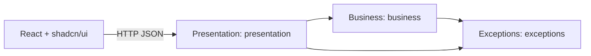

# Sezzle Calculator

Full-stack calculator with a Go JSON API and a React interface. It includes addition, subtraction, multiplication, division, exponentiation, square root, and percentage operations, input validation, browser history, automated tests, and coverage reports.

## Running the Application

Requirements: Go 1.24 or later, Node.js 24, and npm.

Start the backend from the repository root:

```sh
cd Backend
go run .
```

In another terminal, start the frontend:

```sh
cd Frontend
npm ci
npm run dev
```

Open http://localhost:5173. The API listens on http://localhost:8080. Vite forwards `/api` requests to the backend, where calculations are performed in Go.

## Docker

From the repository root:

```sh
docker compose up --build -d
docker compose logs -f
```

To stop the application:

```sh
docker compose down
```

You can also build and run the image directly:

```sh
docker build -t sezzle-calculator .
docker run --rm -p 8080:8080 sezzle-calculator
```

The Dockerfile uses independent build stages for Node and Go. The final image runs the Go binary as an unprivileged user and also serves the compiled React files. The frontend and API share the same origin, so no CORS configuration or separate web server is required.

### Local Production Build

```sh
cd Frontend
npm ci
npm run build
cd ../Backend
go build -o server .
```

## API

All operations use POST, require `Content-Type: application/json`, and return JSON. Operands must be finite JSON numbers: strings, `null`, unknown fields, and missing operands are rejected. The request body limit is 4 KiB.

| Endpoint | Example body | Result | Rule |
| --- | --- | --- | --- |
| `/api/v1/add` | `{"a":12,"b":8}` | `20` | `a + b` |
| `/api/v1/subtract` | `{"a":12,"b":8}` | `4` | `a - b` |
| `/api/v1/multiply` | `{"a":12,"b":8}` | `96` | `a x b` |
| `/api/v1/divide` | `{"a":12,"b":8}` | `1.5` | `a / b`, where `b != 0` |
| `/api/v1/power` | `{"a":2,"b":8}` | `256` | `a` raised to `b` |
| `/api/v1/sqrt` | `{"a":81}` | `9` | Square root of `a`; `b` is not accepted. |
| `/api/v1/percentage` | `{"a":200,"b":15}` | `30` | `b` percent of `a`: `a x b / 100` |

Example with curl (Linux/macOS/Git Bash):

```sh
curl -i http://localhost:8080/api/v1/add \
  -H 'Content-Type: application/json' \
  -d '{"a":12,"b":8}'
```

`200 OK` response:

```json
{"operation":"add","result":20}
```

Division by zero:

```sh
curl -i http://localhost:8080/api/v1/divide \
  -H 'Content-Type: application/json' \
  -d '{"a":10,"b":0}'
```

`422 Unprocessable Entity` response with a consistent structure:

```json
{
  "error": {
    "code": "DIVISION_BY_ZERO",
    "message": "Division by zero is not allowed."
  }
}
```

The code is the stable identifier for clients; the message describes the problem in a human-readable way.

| Status | Situation |
| --- | --- |
| `200` | Valid operation or health check. |
| `400` | Invalid JSON, missing operands, incorrect types, or unknown fields. |
| `404` | Endpoint not found. |
| `405` | HTTP method not allowed; includes the `Allow` header. |
| `413` | Request body exceeds the allowed limit. |
| `415` | Content type is not JSON. |
| `422` | Division by zero, negative square root, non-real exponentiation, or non-finite result. |
| `500` | Unexpected internal error without exposing implementation details to the client. |

## Architecture and Design Decisions



```text
Backend/
  presentation/          HTTP handlers, routes, and static file server
  business/              Calculation logic and mathematical rules
  exceptions/            Typed errors and domain exceptions
  main.go                Startup, configuration, and server lifecycle
Frontend/
  src/                   Interface, API client, and history
  src/components/ui/     shadcn/ui components versioned in the project
reports/                 Test script (test.mjs) and coverage report (coverage.txt)
.github/workflows/       Continuous verification and artifact publishing
```

The application has a single use case, requires no persistence, and does not need a dependency injection container. Separating the layers makes it possible to test the business logic without starting a server and preserves a consistent error contract. Empty repositories, duplicate controllers, or one layer per operation would add complexity without introducing a new responsibility.

The project uses `net/http` from the standard library as its HTTP foundation, without an external framework. It provides the routing and primitives required by this API, reducing dependencies and keeping the architecture framework-independent. Handlers adapt HTTP requests to business logic and convert its errors into JSON responses. If Chi or Gin is adopted in the future, the change can remain concentrated in the presentation layer.

Expected problems are returned as typed `error` values from the `exceptions` layer; `panic` is not used for input validation. The `presentation` layer centralizes the translation into status codes and public messages. Recovery middleware contains unexpected panics and logs their details on the server.

React manages forms, loading states, messages, and history; the backend is the source of calculation results. Vite provides the development proxy and static build. Tailwind and shadcn/ui components provide reusable styles and controls. History is stored in the browser, is not shared between users, and can be cleared from the interface.

### Static Files in `presentation`

The handler serves the compiled frontend only when it receives a valid `STATIC_DIR`. During initialization, `NewHandler` converts the path to an absolute path, resolves its symbolic links, and verifies that a regular `index.html` file exists.

Each request is first classified as an API endpoint. Other `GET` and `HEAD` requests are handled by `serveStatic`. This function validates the path with `fs.ValidPath`, rejects Windows separators and hidden path segments, resolves symbolic links, and verifies that the resolved file remains inside `STATIC_DIR`. Directories and missing files are rejected as well.

When a path without an extension does not match a file, `index.html` is served to support React client-side routes such as `/history`. Missing assets with an extension return `404`. Valid static requests are served with `http.ServeContent`; `index.html` receives `Cache-Control: no-cache` so the SPA shell does not become stale.

## Tests and Reports

Unit and coverage tests run in the backend, where the mathematical rules and API contracts are implemented.

To run the tests and generate the plain-text coverage report (`reports/coverage.txt`) from the repository root:

```sh
node reports/test.mjs
```

The script runs the Go test suite (`go test -v`), calculates atomic function coverage, and stores the result as plain text in `reports/coverage.txt`.

You can also run the checks directly with Go's native tools:

```sh
cd Backend
go test -v ./...
go vet ./...
```

To build the frontend:

```sh
cd Frontend
npm ci
npm run build
```

Backend tests cover operations, domain rules, and the HTTP contract with `httptest`, including input validation, invalid JSON, typed errors, and the static file server.

The generated report in `reports/` is named `coverage.txt`.
